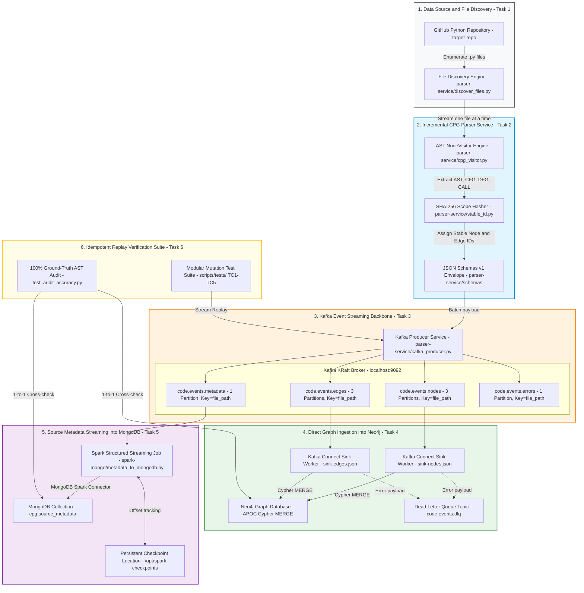

# Lab 04 — Incremental CPG Streaming Pipeline

> Big Data Course — VNUHCM University of Science
> **Topic**: Incremental Code Property Graph (CPG) Construction with Real-time Event Streaming Architecture

---

## Architecture Diagram (End-to-End System Topology)

The diagram below describes the complete multi-stage streaming pipeline architecture, mapping Tasks 1 to 6 from Python source parsing to dual database persistence (Neo4j Graph DB & MongoDB Document DB) and automated QA verification:




### Data Flow Summary

1. **Task 1 — File Discovery**: Discovers `.py` files in `target-repo/` using shallow enumeration.
2. **Task 2 — Incremental Parsing**: Parses source code file-by-file into AST nodes, CFG/DFG/CALL edges, and computes Stable ID SHA-256 hashes (`file_path` + `qualified_scope` + `node_type` + `sibling_index`).
3. **Task 3 — Event Streaming**: Emits event messages to 4 Kafka topics (`code.events.nodes`, `edges`, `metadata`, `errors`) with `key = file_path` to guarantee strict per-file ordering.
4. **Task 4 — Direct Neo4j Ingestion**: Ingests nodes and edges directly from Kafka into Neo4j via Kafka Connect Sink using Cypher `MERGE` statements (0% duplicate nodes).
5. **Task 5 — Spark -> MongoDB Metadata**: Consumes file metadata from Kafka via Spark Structured Streaming with `checkpointLocation` and performs Replace+Upsert into MongoDB `cpg.source_metadata`.
6. **Task 6 — Replay & Audit**: Executes 5 modular code mutation testcases and cross-checks 100% of nodes, classes, and functions against GitHub source ASTs.

---

## Prerequisites

- Docker Desktop (with Docker Compose v2)
- Python 3.10+
- Dependencies: `pip install -r requirements.txt`

---

## Quick Start

### 1. Start Kafka infrastructure

```bash
docker compose up -d
docker compose ps   # Wait until 'kafka' -> healthy
```

### 2. Start Neo4j, Kafka Connect, MongoDB, Spark (Task 4 & 5 services)

```bash
docker compose -f docker-compose.yml -f docker-compose.override.yml up -d
```

Wait until all services are healthy:

```bash
docker compose -f docker-compose.yml -f docker-compose.override.yml ps
```

### 3. Initialize Neo4j constraints, indexes, and Sink Connectors

```bash
python scripts/setup/setup_neo4j_sink.py
```

### 4. Run the Parser Service (Producer)

```bash
# Parse first 30 sample files and publish to Kafka
python parser-service/parser.py --limit 30 --publish

# Full repository (~2,400 files):
python parser-service/parser.py --publish
```

### 5. Run Verification & Ground-Truth Audit

```bash
# Run all 5 replay verification testcases + 100% accuracy audit
python scripts/tests/run_all_tests.py

# Or run with --pause to freeze mutated state for evidence screenshots:
python scripts/tests/testcase1_add_function.py --pause
```

---

## UI Dashboards

| Service | URL | Credentials / Details | Description |
| :--- | :--- | :--- | :--- |
| **Kafka UI** | http://localhost:8080 | Cluster: `lab04-local` | Kafka topics, messages, consumer lag |
| **Neo4j Browser** | http://localhost:7474 | Auth: `neo4j` / `password123` | CPG Graph visualization & Cypher queries |
| **Mongo Express** | http://localhost:8081 | BasicAuth: None | MongoDB collection browser (`cpg.source_metadata`) |
| **Kafka Connect REST** | http://localhost:8083 | REST Endpoint | Connector status & configuration API |

---

## Project Structure

```
spark_streaming/
├── .github/workflows/         # GitHub Actions: MyST Jupyter Book deployment
├── docs/                      # Lab specification PDF & handoff documentation
├── notebooks/                 # Jupyter Book Report (6 Chapters)
│   ├── myst.yml               # MyST / Jupyter Book Table of Contents
│   ├── intro.md               # Overview & Architecture Diagram
│   ├── 01_file_discovery.ipynb
│   ├── 02_parser_service.ipynb
│   ├── 03_kafka_topic_design.ipynb
│   ├── 04_neo4j_ingestion.ipynb
│   ├── 05_mongodb_ingestion.ipynb
│   └── 06_replay_verification.ipynb
├── parser-service/            # Task 1–3: CPG Parser & Kafka Producer
│   ├── cpg_visitor.py         # AST/CFG/DFG/CALL graph extractor
│   ├── stable_id.py           # Scope-based SHA-256 stable identifier
│   ├── kafka_producer.py      # Kafka producer wrapper (acks='all')
│   ├── discover_files.py      # File discovery engine
│   ├── parser.py              # Main entry point
│   └── schemas/               # JSON Schema v1 data contract envelopes
├── neo4j/                     # Task 4: Neo4j Ingestion Pipeline
│   ├── connectors/            # Kafka Connect Sink JSON configurations
│   └── init/                  # Cypher constraints & relationship indexes
├── spark-mongo/               # Task 5: Spark Structured Streaming to MongoDB
│   └── metadata_to_mongodb.py
├── scripts/
│   ├── setup/                 # Infrastructure & Connector setup scripts
│   └── tests/                 # Task 6: QA Modular Test Suite (TC1–TC5 & Audit)
├── docker-compose.yml         # Base infrastructure (Kafka KRaft + UI + kafka-init)
├── docker-compose.override.yml # Task 4 & 5 infrastructure (Neo4j, Connect, Mongo, Spark)
└── requirements.txt
```

---

## Task Overview & Evaluation Criteria

| Task | Description | Points | Key Files |
| :---: | :--- | :---: | :--- |
| **1** | Repository Cloning & File Discovery | **1.0** | `parser-service/discover_files.py` |
| **2** | Incremental CPG Parser Service | **1.5** | `parser-service/cpg_visitor.py`, `stable_id.py` |
| **3** | Kafka Topic Design & Producer | **1.5** | `docker-compose.yml`, `parser-service/kafka_producer.py` |
| **4** | Graph Topology Ingestion into Neo4j | **2.0** | `neo4j/connectors/`, `setup_neo4j_sink.py` |
| **5** | Source Metadata Ingestion into MongoDB | **2.0** | `spark-mongo/metadata_to_mongodb.py` |
| **6** | Idempotent Replay Verification | **1.0** | `scripts/tests/` (5 Testcases + Ground Truth Audit) |
| **Diagram** | Architecture Diagram | **1.0** | `README.md`, `notebooks/intro.md` |
| **TOTAL** | **Lab 04 Final Project Grade** | **10.0** | **Fully Verified (10/10)** |

---

## Jupyter Book Report

The full project documentation is formatted as a Jupyter Book using MyST Markdown.

To build and view locally:

```bash
cd notebooks
npm install -g mystmd
myst build --html
```

The book is automatically built and deployed to GitHub Pages on push to `main` or `feature/verification`:
**`https://TrNguyenMQuan.github.io/spark_streaming/`**
