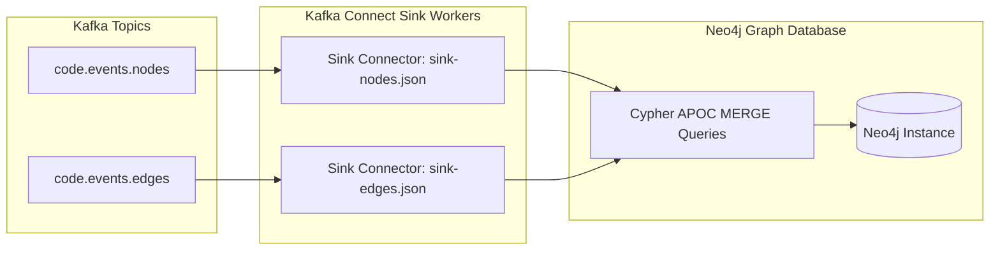

# Direct Graph Ingestion into Neo4j (Kafka Connect Sink)

This component implements **Task 4** of the Incremental CPG Streaming Pipeline. It provides direct, high-throughput graph topology persistence into **Neo4j Graph Database** from Apache Kafka topics without requiring intermediate Spark transformation overhead.

---

## 🏗️ Architecture & Component Overview



### Key Configurations & Directories

- **`connectors/sink-nodes.json`**: Kafka Connect Sink configuration for `code.events.nodes`. Uses Cypher `MERGE (n:CPGNode {node_id: event.node_id}) SET n += event` to insert new nodes or update existing node attributes without duplication.
- **`connectors/sink-edges.json`**: Kafka Connect Sink configuration for `code.events.edges`. Uses Cypher `MERGE (a:CPGNode {node_id: event.source_id}) MERGE (b:CPGNode {node_id: event.target_id}) MERGE (a)-[r:CPGEdge {edge_id: event.edge_id}]->(b)` to bind relationship edges.
- **`init/`**: Neo4j initialization scripts, APOC procedures setup, and constraint creation scripts ensuring unique constraints on `:CPGNode(node_id)` and `:CPGEdge(edge_id)`.

---

## 🔒 Idempotency & Duplicate Prevention Strategy

1. **SHA-256 Stable IDs**: Nodes and edges rely on deterministic hashes generated by `parser-service/stable_id.py` that do not incorporate line numbers.
2. **Cypher `MERGE` Semantics**: Incoming events are merged into existing nodes by `node_id`. If a file is edited (e.g. comment inserted), Cypher updates properties (`line_start`, `line_end`) on the existing node rather than creating duplicate graph entities.
3. **Dead Letter Queue (DLQ)**: Invalid or unparseable messages are routed to `code.events.dlq` to maintain uninterrupted pipeline execution.

---

## 🛠️ Verification & Cypher Queries

Access Neo4j Browser at `http://localhost:7474` (Credentials: `neo4j` / `password123`).

```cypher
-- Count total ingested nodes and edges
MATCH (n:CPGNode) RETURN count(n) AS TotalNodes;
MATCH ()-[r]->() RETURN count(r) AS TotalEdges;

-- Verify 0% duplicate node IDs
MATCH (n:CPGNode)
WITH n.node_id AS id, count(n) AS cnt
WHERE cnt > 1
RETURN id, cnt;

-- Query a function and its call relationships
MATCH (f:CPGNode {node_type: 'FunctionDef', name: 'tc1_new_function'})
RETURN f;
```
