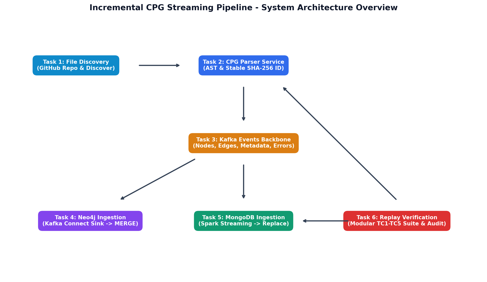

# Lab 04 — Incremental CPG Streaming Pipeline

Báo cáo đồ án: Xây dựng pipeline streaming trích xuất **Code Property Graph (CPG)** từ kho mã nguồn Python `huggingface/transformers`, phát qua **Apache Kafka**, ingest song song vào **Neo4j** (Kafka Connect Sink) và **MongoDB** (Spark Structured Streaming).

Mỗi chương tương ứng một task trong đề bài.

---

## Sơ đồ Kiến trúc Hệ thống (Architecture Diagram)

Sơ đồ thể hiện luồng dữ liệu end-to-end từ bước trích xuất mã nguồn đến lưu trữ đồ thị và metadata:

---

## Mục lục Sách Jupyter Book

- **Chương 1** — Task 1: Repository Cloning & File Discovery
- **Chương 2** — Task 2: Incremental CPG Parser Service
- **Chương 3** — Task 3: Kafka Topic Design & Producer
- **Chương 4** — Task 4: Graph Topology Ingestion into Neo4j
- **Chương 5** — Task 5: Source Metadata Ingestion into MongoDB
- **Chương 6** — Task 6: Idempotent Replay Verification
