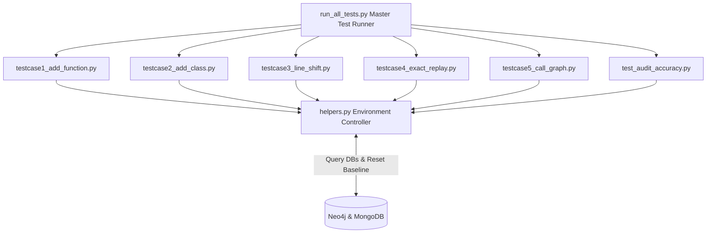

# Verification & Test Automation Suite (Task 6)

This component implements **Task 6** and pipeline QA automation. It provides a modular test suite (`scripts/tests/`) for verifying 100% idempotent stream replay, zero graph/document duplication upon code mutation, and 1-to-1 ground-truth accuracy cross-checking with GitHub source code.

---

## 🏗️ Test Suite Overview & Architecture



---

## 🧪 5 Modular Code Mutation Testcases

| Testcase Script | Code Mutation Scenario | Neo4j Assertion | MongoDB Assertion |
|---|---|---|---|
| `testcase1_add_function.py` | Add new function `tc1_new_function` | `+2 Nodes`, `0% Duplicates` | Document replaced (`LOC +2`, `Nodes +2`) |
| `testcase2_add_class.py` | Add class `Tc2TestClass` with method | `+2 Nodes`, AST Edge created | Document replaced (`file_hash` updated) |
| `testcase3_line_shift.py` | Prepend 10 comment lines at top | `0 New Nodes` (`nodes_tc3 == nodes_base`) | Document replaced (`LOC +10`) |
| `testcase4_exact_replay.py` | Re-publish unchanged baseline files | `Exact Match` (`3094 Nodes, 5866 Edges`) | `30 Documents` (0 duplicate files) |
| `testcase5_call_graph.py` | Add caller function invoking `tc1` | `+2 Nodes`, `:CALL` Edge created | Document updated (`num_edges +1`) |

---

## 🛠️ Ground-Truth Accuracy Audit

`test_audit_accuracy.py` verifies 1-to-1 fidelity between GitHub source code and database state:
- Asserts every parsed Python file has a matching document in MongoDB.
- Asserts function and class definitions in Neo4j match 100% with the AST ground-truth of the repository.

---

## 🚀 Execution & CLI Commands

Run commands from the project root:

```bash
# Execute the entire modular test suite and ground-truth audit
python scripts/tests/run_all_tests.py

# Run a single testcase independently
python scripts/tests/testcase1_add_function.py

# Pause execution after testcase mutation to inspect UI evidence in Neo4j/Mongo Express
python scripts/tests/testcase1_add_function.py --pause

# Retain mutated test data in databases (skip automatic environment reset)
python scripts/tests/testcase1_add_function.py --no-teardown

# Restore baseline environment (wipe databases & re-publish 30 baseline files)
python scripts/tests/helpers.py --reset
```
