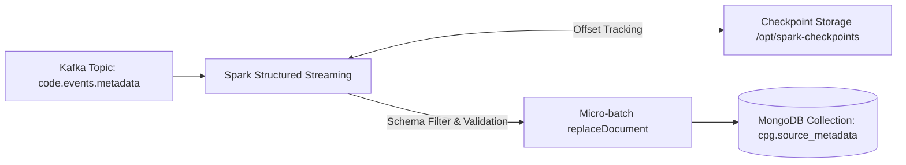

# Source Metadata Ingestion into MongoDB (Spark Structured Streaming)

This component implements **Task 5** of the Incremental CPG Streaming Pipeline. It uses **PySpark Structured Streaming** to consume source file metadata events from Apache Kafka, validate payload schemas, and continuously persist state into **MongoDB** with checkpointed restart resilience.

---

## 🏗️ Architecture & Component Overview



### Core Files & Scripts

- **`metadata_to_mongodb.py`**: The PySpark Structured Streaming application. Reads JSON streams from `code.events.metadata`, validates schema version `v1` and ISO UTC timestamps, deduplicates events by `file_path`, and executes `replaceDocument` operations on MongoDB via `foreachBatch`.
- **`Dockerfile` / Container setup**: Packages Spark 3.5.x with MongoDB Spark Connector dependencies (`mongo-spark-connector_2.12:10.3.0`).

---

## 🔄 Replace + Upsert & Restart Resilience

1. **Replace Strategy**: Uses `operationType = "replace"` with stable primary key `idFieldList = ["file_path"]`. When a file is modified and re-published, Spark replaces the existing MongoDB document by matching `file_path` instead of appending duplicates.
2. **Persistent Checkpoints**: Configured with `checkpointLocation = "/opt/spark-checkpoints"`. If the Spark container restarts or crashes, Spark resumes processing strictly from the last committed Kafka offsets, skipping already processed messages.

---

## 🚀 Execution & Verification Commands

```bash
# Execute PySpark streaming job locally (or inside Spark container)
docker exec -it spark-master spark-submit \
  --packages org.apache.spark:spark-sql-kafka-0-10_2.12:3.5.0,org.mongodb.spark:mongo-spark-connector_2.12:10.3.0 \
  spark-mongo/metadata_to_mongodb.py

# Verify MongoDB documents via mongosh in Docker container
docker exec -it mongodb mongosh cpg --quiet --eval "db.source_metadata.countDocuments()"

# Access Mongo Express UI
# Browser URL: http://localhost:8081 (Database: cpg, Collection: source_metadata)
```
